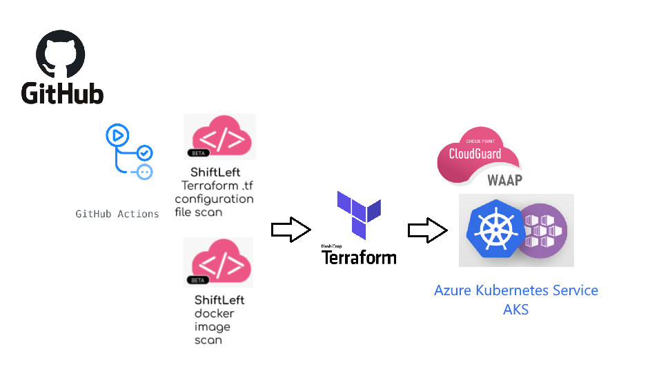

# CloudGuard_WAAP_K8
Written by Michael Braun

<p align="left">
    
</p>    

This document outlines how to deploy the [OWASP Juice Shop](https://github.com/bkimminich/juice-shop) and Cloudguard WAAP to Azure Kubernetes Service (AKS). Furthermore, this deployment is done with Github Actions and illustrates how to incorperate Cloudguard Shiftleft into a CI/CD pipeline.

From a high level, this is what happens:

Github Actions Build Pipeline: <br>
    1. Prepares environment <br>
    2. Creates configuration files to connect to Terraform Cloud <br>
    3. Performs Shiftleft IAC scan and compares against rules I have created in Cloudguard CSPM <br>
    4. Performs Shiftleft Container Scan <br>
    5. Installs Terraform & Runs Terraform init, plan and apply. <br>
    6. Terraform: <br>
        a. Creates an AKS cluster. <br>
        b. Uses Helm to install WAAP Pod <br>
        c. Outputs URL <br>
        
Github Actions Destroy Pipeline: <br>
    1. Prepares environment <br>
    2. Creates configuration files to connect to Terraform Cloud <br>
    3. Performs Terraform Destroy <br>

        
        

## Prerequisites

[Github Account](https://github.com) <br>
[Azure Account](https://portal.azure.com) <br>
[Terraform Cloud Account](https://terraform.io) <br>
[Check Point CSPM Account](https://secure.dome9.com/v2/login) - Terraform Compliance Rule and Rule ID <br>
[Check Point Cloud Portal](https://portal.checkpoint.com) -  WAAP Token <br>

## Setup 

Fork the [CloudGuard_WAAP_K8](https://github.com/metalstormbass/CloudGuard_WAAP_K8) repository into your personal Github account. 
<br>

### Microsoft Azure
 Create an App Registration in Azure. As this will be used multiple times, please note the following:

- Application (client) ID <br>
- Directory (tenant) ID <br>
- Secret <br>
- Subscription ID <br>

Ensure that you give this app registration "Contributor" permission. This is required for Terraform to build the environment.

### Terraform
Terraform Cloud is being used to host the variables and the state file. The actual run occurs in Github Actions.

Create a new workspace in your Orginization and select CLI-driven run. The configure your variables.


Start with the Environment Variables. Input the Azure App Registration information you noted earlier. Use the following keys.


```bash
ARM_CLIENT_ID 
ARM_CLIENT_SECRET 
ARM_TENANT_ID 
ARM_SUBSCRIPTION_ID
``` 

Then fill in the variables required to run the Terraform playbook. Reuse the Azure App Registration client id and secret for the client_id. <b>Note: You cannot have spaces or special characters. This is an Azure limitation</b>


<br><br>

Here are the key names you must use: <br>
```bash
victim_company #This is used for naming the objects within Azure 
client_secret  #This is the client secret from the Azure App Registration created above. Required to connect to the AKS Cluster
client_id #This is the client id from the Azure App Registration created above. Required to connect to the AKS Cluster
token #This is the WAAP token
namespace #This is the namespace of the AKS Cluster
```
Under the user settings, select Tokens and create an API token. Note the value for later. <br><br>
 <br><br>

Finally, in the workspace you created, click on Settings > General Settings and note the Workspace ID. We need to this to setup the API call to Terraform.io

### Github Actions
In this example, I am using Github Actions as the CI/CD tool. To prep the pipeline, please create the following secrets: <br>


<br>

```bash
CHKP_CLOUDGUARD_ID #This is the CSPM API Key
CHKP_CLOUDGUARD_SECRET #CSPM API Key Secret
CSPM_RULE #The ID of your CSPM Terraform Rule
ORGANIZATION #Terraform Organization in Terraform Cloud
SG_CLIENT_ID #Sourceguard API Key
SG_SECRET_KEY #Sourceguard API Secret
TERRAFORM #Terraform Cloud API Key
WORKSPACE #Terraform Cloud Workspace - Get this from Terraform.io
```

<br>
You should now be ready to run the pipeline. There are two actions your can perform. Build and Destroy. To kickoff either action, edit either the _build_flag or the _destroy_flag. Once you commit the change, the associated pipeline will start to run. You can view the status of the run by clicking on the "Actions" tab  <br> <br>

Here is an example of a build run<br>


Here is the ShiftLeft IAC Scan<br>


Here is the ShiftLeft Container Scan <br>

 

Expand the Terraform Apply and scroll to the bottom to see the outputs. <br>

 

### Destruction

To destroy the environment, modify the _destroy_flag. 


